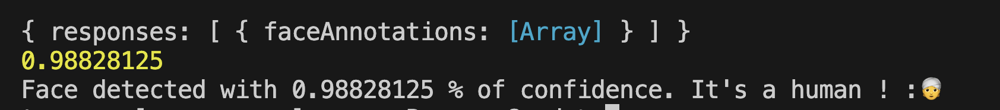
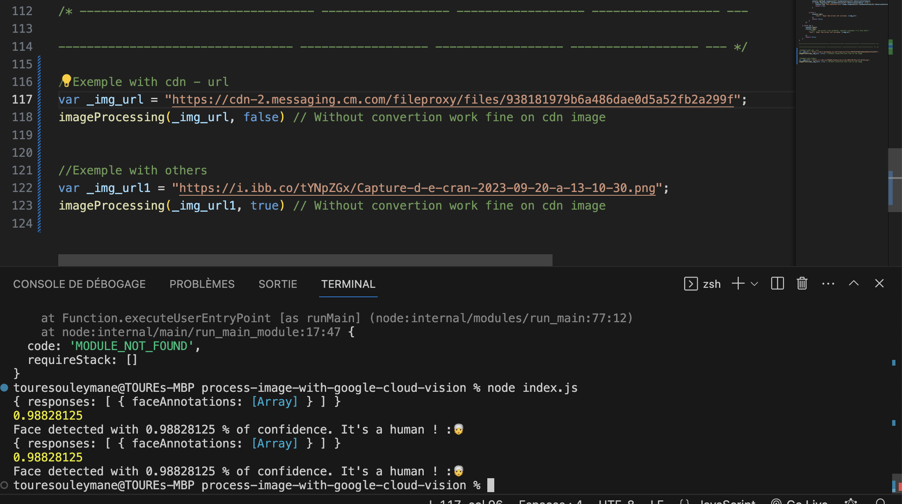

## Type de fonctionnalité 


- <b>CROP_HINTS</b> 	Suggère des sommets pour cadrer une zone d'une image.
- <b>DOCUMENT_TEXT_DETECTION</b> 	Exécute la reconnaissance optique de caractères (OCR) sur des images de texte dense, telles que des documents (PDF/TIFF) et des images contenant du texte manuscrit. 
- <b>TEXT_DETECTION</b> peut être utilisé pour les images de texte épars. Prioritaire lorsque DOCUMENT_TEXT_DETECTION et TEXT_DETECTION sont présents.
- <b>FACE_DETECTION</b> 	Détecte les visages dans l'image.
- <b>IMAGE_PROPERTIES</b> 	Calcule un ensemble de propriétés d'image, telles que les couleurs dominantes de l'image.
- <b>LABEL_DETECTION</b> 	Ajoute des libellés en fonction du contenu de l'image.
- <b>LANDMARK_DETECTION</b> 	Détecte les points de repères géographiques dans l'image.
- LOGO_DETECTION 	Détecte les logos d'entreprise dans l'image.
- <b>OBJECT_LOCALIZATION</b> 	Détecte et extrait plusieurs objets dans une image.
- <b>SAFE_SEARCH_DETECTION</b> 	Exécute des requêtes SafeSearch pour détecter du contenu potentiellement dangereux ou indésirable.
- <b>TEXT_DETECTION</b> 	Effectue une reconnaissance optique des caractères (OCR) sur le texte de l'image. La détection de texte est optimisée pour les zones de texte épars dans une image plus grande. Si l'image est un document au format PDF ou TIFF au texte dense, ou s'il contient du texte manuscrit, utilisez plutôt DOCUMENT_TEXT_DETECTION.
- <b>WEB_DETECTION</b> 	Détectez des entités thématiques, telles que des actualités, des événements ou des célébrités dans l'image, et trouvez des images similaires sur le Web grâce à la puissance de la recherche d'images Google. 


### API CALL ######
```
https://vision.googleapis.com/v1/images:annotate

{
  "requests": [
    {
      "features": [
        {
          "maxResults": 50,
          "type": "LANDMARK_DETECTION"
        },
        {
          "maxResults": 50,
          "type": "FACE_DETECTION"
        },
        {
          "maxResults": 50,
          "type": "OBJECT_LOCALIZATION"
        },
        {
          "maxResults": 50,
          "type": "LOGO_DETECTION"
        },
        {
          "maxResults": 50,
          "type": "LABEL_DETECTION"
        },
        {
          "maxResults": 50,
          "model": "builtin/latest",
          "type": "DOCUMENT_TEXT_DETECTION"
        },
        {
          "maxResults": 50,
          "type": "SAFE_SEARCH_DETECTION"
        },
        {
          "maxResults": 50,
          "type": "IMAGE_PROPERTIES"
        },
        {
          "maxResults": 50,
          "type": "CROP_HINTS"
        }
      ],
      "image": {
        "content": "(data from Capture d’écran 2023-09-20 à 13.10.30.png)"
      },
      "imageContext": {
        "cropHintsParams": {
          "aspectRatios": [
            0.8,
            1,
            1.2
          ]
        }
      }
    }
  ]
}
```


#### RETURN EXAMPLE JSON 
```js
const l = {
  "responses": [
    {
      "faceAnnotations": [
        {
          "boundingPoly": {
            "vertices": [
              {
                "x": 167,
                "y": 14
              },
              {
                "x": 484,
                "y": 14
              },
              {
                "x": 484,
                "y": 383
              },
              {
                "x": 167,
                "y": 383
              }
            ]
          },
          "fdBoundingPoly": {
            "vertices": [
              {
                "x": 200,
                "y": 104
              },
              {
                "x": 447,
                "y": 104
              },
              {
                "x": 447,
                "y": 351
              },
              {
                "x": 200,
                "y": 351
              }
            ]
          },
          "landmarks": [
            {
              "type": "LEFT_EYE",
              "position": {
                "x": 272.59042,
                "y": 196.05531,
                "z": 0.00079381466
              }
            },
            {
              "type": "RIGHT_EYE",
              "position": {
                "x": 373.8796,
                "y": 195.27777,
                "z": -2.634175
              }
            },
            {
              "type": "LEFT_OF_LEFT_EYEBROW",
              "position": {
                "x": 244.73836,
                "y": 171.25443,
                "z": 8.72343
              }
            },
            {
              "type": "RIGHT_OF_LEFT_EYEBROW",
              "position": {
                "x": 300.88834,
                "y": 173.51509,
                "z": -19.50863
              }
            },
            {
              "type": "LEFT_OF_RIGHT_EYEBROW",
              "position": {
                "x": 345.83115,
                "y": 172.779,
                "z": -20.726587
              }
            },
            {
              "type": "RIGHT_OF_RIGHT_EYEBROW",
              "position": {
                "x": 403.41568,
                "y": 172.30096,
                "z": 4.2014427
              }
            },
            {
              "type": "MIDPOINT_BETWEEN_EYES",
              "position": {
                "x": 323.7821,
                "y": 192.93149,
                "z": -20.773516
              }
            },
            {
              "type": "NOSE_TIP",
              "position": {
                "x": 322.13956,
                "y": 247.8946,
                "z": -46.105312
              }
            },
            {
              "type": "UPPER_LIP",
              "position": {
                "x": 321.3909,
                "y": 286.10248,
                "z": -23.853752
              }
            },
            {
              "type": "LOWER_LIP",
              "position": {
                "x": 322.83774,
                "y": 320.0285,
                "z": -16.094486
              }
            },
            {
              "type": "MOUTH_LEFT",
              "position": {
                "x": 288.64838,
                "y": 302.14978,
                "z": 2.158459
              }
            },
            {
              "type": "MOUTH_RIGHT",
              "position": {
                "x": 360.47812,
                "y": 301.2259,
                "z": 0.31276822
              }
            },
            {
              "type": "MOUTH_CENTER",
              "position": {
                "x": 323.4019,
                "y": 303.08203,
                "z": -16.4103
              }
            },
            {
              "type": "NOSE_BOTTOM_RIGHT",
              "position": {
                "x": 350.63394,
                "y": 263.20056,
                "z": -12.515492
              }
            },
            {
              "type": "NOSE_BOTTOM_LEFT",
              "position": {
                "x": 297.49805,
                "y": 259.43884,
                "z": -10.573087
              }
            },
            {
              "type": "NOSE_BOTTOM_CENTER",
              "position": {
                "x": 322.43216,
                "y": 267.0959,
                "z": -24.901983
              }
            },
            {
              "type": "LEFT_EYE_TOP_BOUNDARY",
              "position": {
                "x": 270.96063,
                "y": 187.04678,
                "z": -5.5763326
              }
            },
            {
              "type": "LEFT_EYE_RIGHT_CORNER",
              "position": {
                "x": 291.4393,
                "y": 199.02856,
                "z": -0.49916887
              }
            },
            {
              "type": "LEFT_EYE_BOTTOM_BOUNDARY",
              "position": {
                "x": 270.81638,
                "y": 203.73672,
                "z": -0.8045614
              }
            },
            {
              "type": "LEFT_EYE_LEFT_CORNER",
              "position": {
                "x": 253.57724,
                "y": 196.16782,
                "z": 9.128257
              }
            },
            {
              "type": "RIGHT_EYE_TOP_BOUNDARY",
              "position": {
                "x": 375.35364,
                "y": 185.97212,
                "z": -8.271586
              }
            },
            {
              "type": "RIGHT_EYE_RIGHT_CORNER",
              "position": {
                "x": 392.54053,
                "y": 195.48769,
                "z": 5.4342313
              }
            },
            {
              "type": "RIGHT_EYE_BOTTOM_BOUNDARY",
              "position": {
                "x": 375.28732,
                "y": 203.00151,
                "z": -3.4957972
              }
            },
            {
              "type": "RIGHT_EYE_LEFT_CORNER",
              "position": {
                "x": 355.08783,
                "y": 198.67268,
                "z": -2.0949523
              }
            },
            {
              "type": "LEFT_EYEBROW_UPPER_MIDPOINT",
              "position": {
                "x": 272.7002,
                "y": 163.9469,
                "z": -11.73918
              }
            },
            {
              "type": "RIGHT_EYEBROW_UPPER_MIDPOINT",
              "position": {
                "x": 374.85242,
                "y": 163.87697,
                "z": -14.524853
              }
            },
            {
              "type": "LEFT_EAR_TRAGION",
              "position": {
                "x": 225.45807,
                "y": 222.74762,
                "z": 121.22663
              }
            },
            {
              "type": "RIGHT_EAR_TRAGION",
              "position": {
                "x": 427.38754,
                "y": 219.64314,
                "z": 115.67296
              }
            },
            {
              "type": "FOREHEAD_GLABELLA",
              "position": {
                "x": 323.86777,
                "y": 172.4698,
                "z": -23.379927
              }
            },
            {
              "type": "CHIN_GNATHION",
              "position": {
                "x": 324.9998,
                "y": 356.49194,
                "z": -0.92426443
              }
            },
            {
              "type": "CHIN_LEFT_GONION",
              "position": {
                "x": 246.83363,
                "y": 303.70117,
                "z": 84.54832
              }
            },
            {
              "type": "CHIN_RIGHT_GONION",
              "position": {
                "x": 404.16928,
                "y": 306.31607,
                "z": 79.56221
              }
            },
            {
              "type": "LEFT_CHEEK_CENTER",
              "position": {
                "x": 256.96405,
                "y": 261.33115,
                "z": 11.336462
              }
            },
            {
              "type": "RIGHT_CHEEK_CENTER",
              "position": {
                "x": 389.68356,
                "y": 260.50998,
                "z": 7.827534
              }
            }
          ],
          "rollAngle": -0.05242119,
          "panAngle": -1.5432438,
          "tiltAngle": -2.9078963,
          "detectionConfidence": 0.98828125,
          "landmarkingConfidence": 0.7496919,
          "joyLikelihood": "VERY_UNLIKELY",
          "sorrowLikelihood": "VERY_UNLIKELY",
          "angerLikelihood": "VERY_UNLIKELY",
          "surpriseLikelihood": "VERY_UNLIKELY",
          "underExposedLikelihood": "VERY_UNLIKELY",
          "blurredLikelihood": "VERY_UNLIKELY",
          "headwearLikelihood": "VERY_UNLIKELY"
        }
      ]
    }
  ]
}
```

#### IS Human
```js
console.log(l.responses[0]?.faceAnnotations[0]?.detectionConfidence)
if(l.responses[0]?.faceAnnotations[0]?.detectionConfidence > 0.6){
    console.log(`Face detected with ${l.responses.detectionConfidence} % of confidence. It's a human ! :👳`);
}
```


#### RETURN EXAMPLE JSON



| Auteur |
|:--------------|
| @toure5013 |